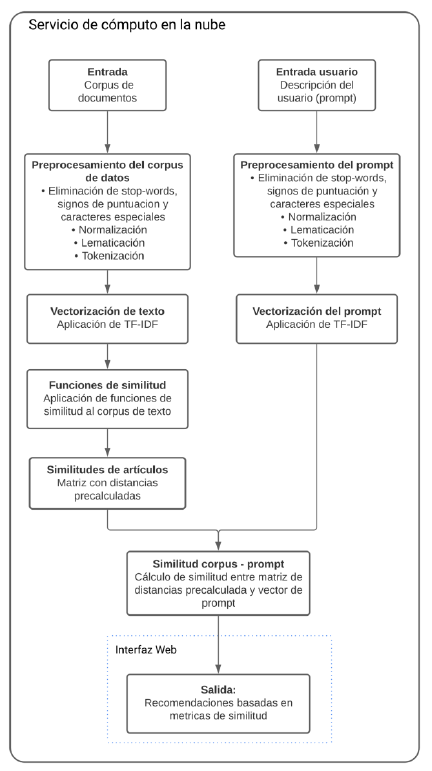

Arxiv ML Paper Recommender
==============================

## Table of Contents

1. [Introduction](#introduction)
2. [Key Components](#key-components)
3. [Process Flow](#process-flow)
4. [End-to-end Architecture](#end-to-end-architecture)
5. [Getting Started](#getting-started)
6. [Repository Setup](#repository-setup)
    - [Clone the repository](#clone-the-repository)
    - [Set up the Python virtual environment](#set-up-the-python-virtual-environment)
    - [Install the required dependencies](#install-the-required-dependencies)
7. [Local Setup](#local-setup)
    - [DVC Setup](#dvc-setup)
    - [Authorization](#authorization)
    - [Google Drive Setup](#google-drive-setup)
8. [Dataset](#dataset)
9. [Results](#results)
10. [Project Organization](#project-organization)


# Introduction

Welcome to the Scientific Article Recommendation System repository. This project leverages machine learning and natural language processing techniques to streamline the search for relevant scientific content for researchers and professionals. By utilizing the TF-IDF algorithm for text vectorization and cosine similarity metrics, the system effectively suggests scientific articles based on user-provided prompts.

## Key Components
- Preprocessing of Data: Both the scientific corpus and the user prompt undergo preprocessing steps, including the removal of stop-words, punctuation, and special characters, followed by normalization, lemmatization, and tokenization.
- Text Vectorization: Application of the TF-IDF algorithm to convert both the corpus and user prompt into numerical vectors.
- Similarity Functions: Calculation of similarity metrics, primarily using cosine similarity, between the preprocessed and vectorized corpus and user prompt.
Precomputed Similarities: Creation of a matrix with precomputed distances for efficient similarity computation.
- Web Interface: A user-friendly interface hosted on Huggingface Spaces for easy interaction with the recommendation system.
## Process Flow:
- Input: The system accepts a corpus of scientific documents and a user-provided prompt.
- Preprocessing: Both inputs are preprocessed to clean and prepare the text data.
- Vectorization: TF-IDF is applied to convert text into vectors.
- Similarity Calculation: Similarity functions are applied to determine the relevance of documents to the user prompt.
- Recommendation Output: The system generates recommendations based on the similarity metrics and presents them via a web interface.

The solution not only focuses on the recommendation engine but also emphasizes the creation of a user interface to facilitate easy and efficient personalized recommendations.

## End-to-end Architecture
The following figure illustrates the proposed recommendation system's workflow and extends it with additional modules for user interaction, prompt preprocessing, and web interface integration.



# Getting Started
To get started with the Scientific Article Recommendation System, please refer to the following sections of this README for setup instructions, usage guidelines, and contribution details.

## Repository Setup

To install and set up the ML Paper Recommendation System, follow these steps:

1. Clone the repository:

   ```bash
   git clone https://github.com/LewisPons/arxiv-paper-recommender-system.git
   cd arxiv-paper-recommender
   ```

2. Set up the Python virtual environment:
   ```bash
   python3 -m venv arxiv-env
   source arxiv-env/bin/activate
   ```

3. Install the required dependencies:
   ```bash
   pip3 install -r requirements.txt
   ```
## Local Setup

For this project to run locally you have to download a set of Parquet and Binaries files. There are two approaches:
- Use DVC to setup all
- Download manually the files

Both approaches are explaned in the next sections.

### DVC Setup
If not familiarized to DVC, please read this [User guide](https://dvc.org/doc/user-guide).

### Authorization
See https://dvc.org/doc/user-guide/data-management/remote-storage/google-drive#authorization for further details.

1. Add the remote GStorage bucket
   ```bash
   dvc remote add --default drive gdrive://{ask_the_bucket_ownert_the_key}
   ```

2. Run
   ```bash
   dvc remote modify drive gdrive_acknowledge_abuse true
   pip install dvc_gdriv
   ```

For more details about setting up DVC GDrive storage click [this link](https://blog.devgenius.io/how-to-connect-dvc-to-google-drive-remote-storage-to-store-and-version-your-data-64db2fad73ad)

### Google Drive Setup
If the DVC Setup is not working, you can manually download the Dataset and Model files from this [Google Drive Bucket](https://drive.google.com/drive/folders/1nv1Y_XMlQW4vnOD_S0cd0w-0FQXUHjfs?usp=sharing) into the `models` Folder ensuring following this structure.
```bash
models/
├── GrammarGuru
│   ├── data
│   │   └── LanguageLiberator.parquet.gzip
│   ├── dictionaries
│   │   └── LanguageLiberator.dict
│   ├── similarities_matrix
│   │   ├── LanguageLiberator
│   │   ├── LanguageLiberator.index.data.npy
│   │   ├── LanguageLiberator.index.indices.npy
│   │   ├── LanguageLiberator.index.indptr.npy
│   │   └── LanguageLiberator.index.npy
│   └── tdidf
│       └── LanguageLiberator.model
├── LanguageLiberator
│   ├── data
│   │   └── LanguageLiberator.parquet.gzip
│   ├── dictionaries
│   │   └── LanguageLiberator.dict
│   ├── similarities_matrix
│   │   ├── LanguageLiberator
│   │   ├── LanguageLiberator.index.data.npy
│   │   ├── LanguageLiberator.index.indices.npy
│   │   ├── LanguageLiberator.index.indptr.npy
│   │   └── LanguageLiberator.index.npy
│   └── tdidf
│       └── LanguageLiberator.model
├── SemanticSherlock
│   ├── data
│   │   └── SemanticSherlock.parquet.gzip
│   ├── dictionaries
│   │   └── SemanticSherlock.dict
│   ├── similarities_matrix
│   │   ├── SemanticSherlock
│   │   ├── SemanticSherlock.index.data.npy
│   │   ├── SemanticSherlock.index.indices.npy
│   │   ├── SemanticSherlock.index.indptr.npy
│   │   └── SemanticSherlock.index.npy
│   └── tdidf
│       └── SemanticSherlock.model
└── TextualTango
    ├── data
    │   └── TextualTango.parquet.gzip
    ├── dictionaries
    │   └── TextualTango.dict
    ├── similarities_matrix
    │   ├── TextualTango
    │   ├── TextualTango.index.data.npy
    │   ├── TextualTango.index.indices.npy
    │   ├── TextualTango.index.indptr.npy
    │   └── TextualTango.index.npy
    └── tdidf
        └── TextualTango.model
```

## Dataset
The Recommendation System utilizes a corpus of summaries of STEM papers as the training dataset. [This dataset](https://www.kaggle.com/datasets/spsayakpaul/arxiv-paper-abstracts) contains paper titles, paper abstracts, and their subject categories collected from the arXiv portal.


## Results
[Results in this section]


# Project Organization


    ├── LICENSE
    ├── Makefile           <- Makefile with commands like `make data` or `make train`
    ├── README.md          <- The top-level README for developers using this project.
    ├── data
    │   ├── external       <- Data from third party sources.
    │   ├── interim        <- Intermediate data that has been transformed.
    │   ├── processed      <- The final, canonical data sets for modeling.
    │   └── raw            <- The original, immutable data dump.
    │
    ├── docs               <- A default Sphinx project; see sphinx-doc.org for details
    │
    ├── models             <- Trained and serialized models, model predictions, or model summaries
    │
    ├── notebooks          <- Jupyter notebooks. Naming convention is a number (for ordering),
    │                         the creator's initials, and a short `-` delimited description, e.g.
    │                         `1.0-jqp-initial-data-exploration`.
    │
    ├── references         <- Data dictionaries, manuals, and all other explanatory materials.
    │
    ├── reports            <- Generated analysis as HTML, PDF, LaTeX, etc.
    │   └── figures        <- Generated graphics and figures to be used in reporting
    │
    ├── requirements.txt   <- The requirements file for reproducing the analysis environment, e.g.
    │                         generated with `pip freeze > requirements.txt`
    │
    ├── setup.py           <- makes project pip installable (pip install -e .) so src can be imported
    ├── src                <- Source code for use in this project.
    │   ├── __init__.py    <- Makes src a Python module
    │   │
    │   ├── data           <- Scripts to download or generate data
    │   │   └── make_dataset.py
    │   │
    │   ├── features       <- Scripts to turn raw data into features for modeling
    │   │   └── build_features.py
    │   │
    │   ├── models         <- Scripts to train models and then use trained models to make
    │   │   │                 predictions
    │   │   ├── predict_model.py
    │   │   └── train_model.py
    │   │
    │   └── visualization  <- Scripts to create exploratory and results oriented visualizations
    │       └── visualize.py
    │
    └── tox.ini            <- tox file with settings for running tox; see tox.readthedocs.io
****


